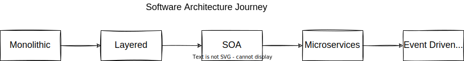

# software-architecture

Software architecture design &amp; samples using java
  Udemy course base for this
repo :  https://www.udemy.com/course/design-microservices-architecture-with-patterns-principles/

## Software architecture types :

- [Monolithic](designs/monolithic)
- [Layered](designs/layered)
- [Service oriented architecture (SOA)](designs/soa)
- [Microservices](designs/microservices)

## Microservices :

- [Introduction](designs/microservices)
- [Decomposition](designs/decomposition-microservices)
- [Communication](designs/microservices-communication)
- [Gateway](designs/microservices-gateways)
- [Async Communication (message based)](designs/microservices-async-comm-message)
- [Kafka & RabbitMQ](designs/kafka-and-rabbitmq)
- [Scale](designs/microservices-scale)
- [Data Management](designs/microservices-data%20management)
- [Data Management Queries](designs/microservices-data%20management%20queries)
- [Distributed Transactions](designs/microservices-distributed%20transaction)
- [Event Driven](designs/event-driven-microservices)
- [Distributed Caching](designs/microservices-distributed%20caching)
- [Containers & Orchestrators](designs/microservices-containers%20&%20orchestrators)

## E-commerce architecture journey

