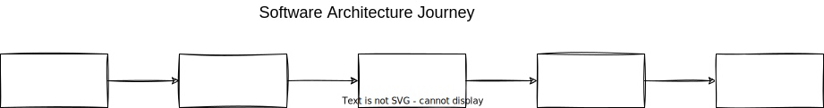

## Software architecture types :

- [Monolithic](monolithic)
- [Layered](layered)
- [Service oriented architecture (SOA)](soa)
- [Microservices](microservices)

## Microservices :

- [Introduction](microservices)
- [Decomposition](decomposition-microservices)
- [Communication](microservices-communication)
- [Gateway](microservices-gateways)
- [Async Communication (message based)](microservices-async-comm-message)
- [Kafka & RabbitMQ](kafka-and-rabbitmq)
- [Scale](microservices-scale)
- [Data Management](microservices-data%20management)
- [Data Management Queries](microservices-data%20management%20queries)
- [Distributed Transactions](microservices-distributed%20transaction)
- [Event Driven](event-driven-microservices)
- [Distributed Caching](microservices-distributed%20caching)
- [Containers & Orchestrators](microservices-containers%20&%20orchestrators)

