# Microservices decomposition

## Decomposition path :

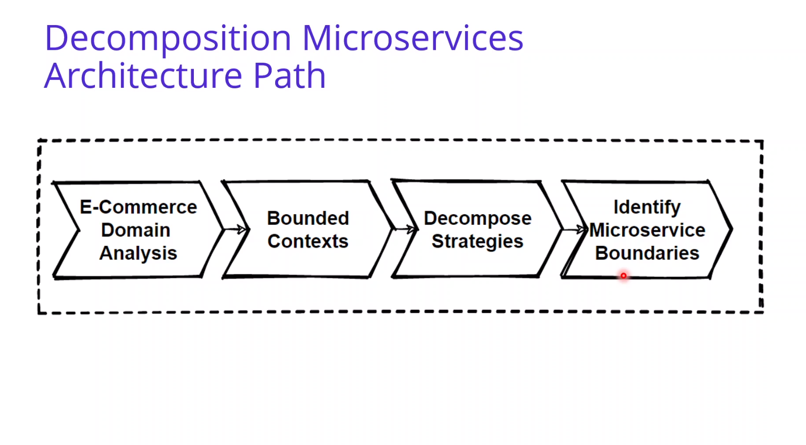

## Decomposition patterns :

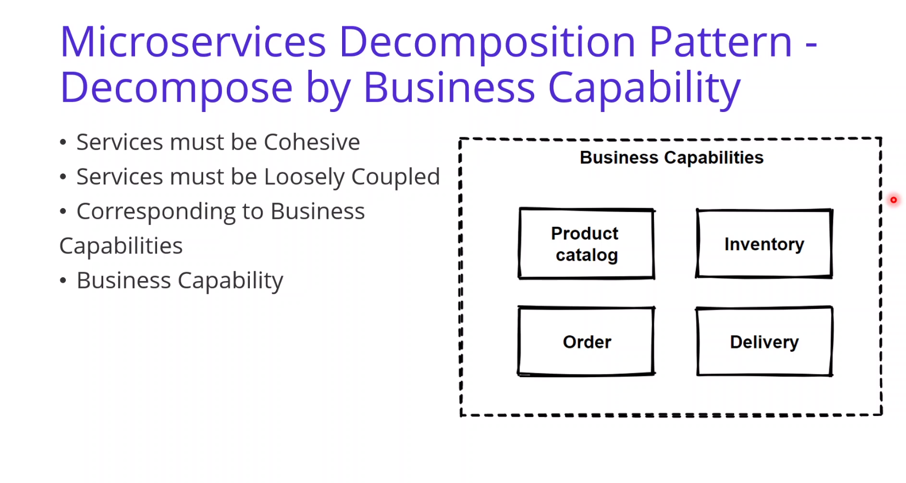
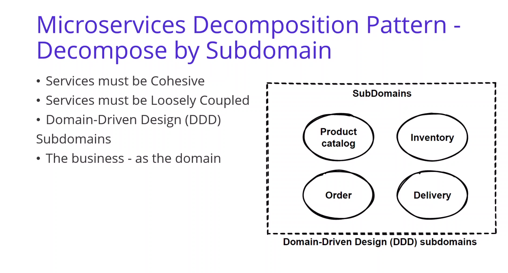

## Bounded context pattern :

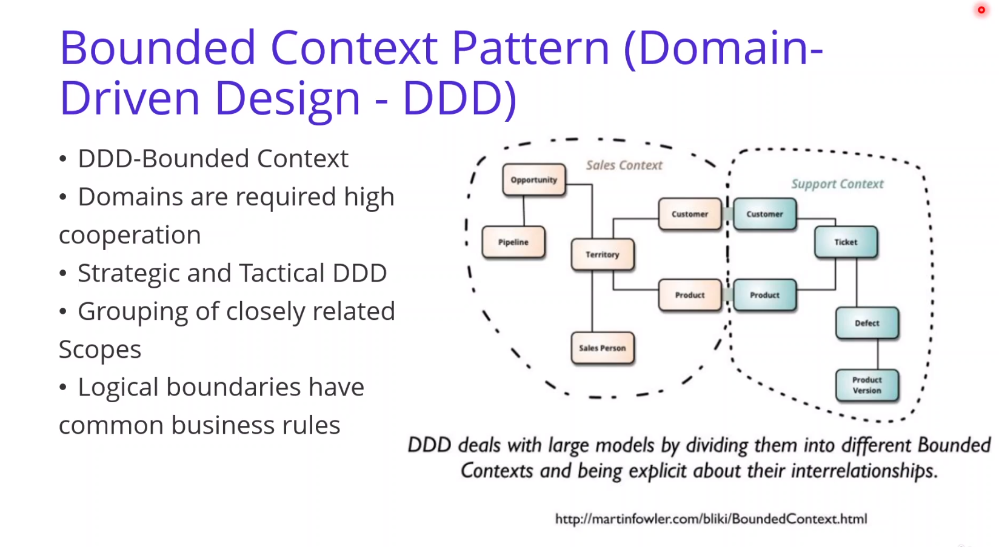
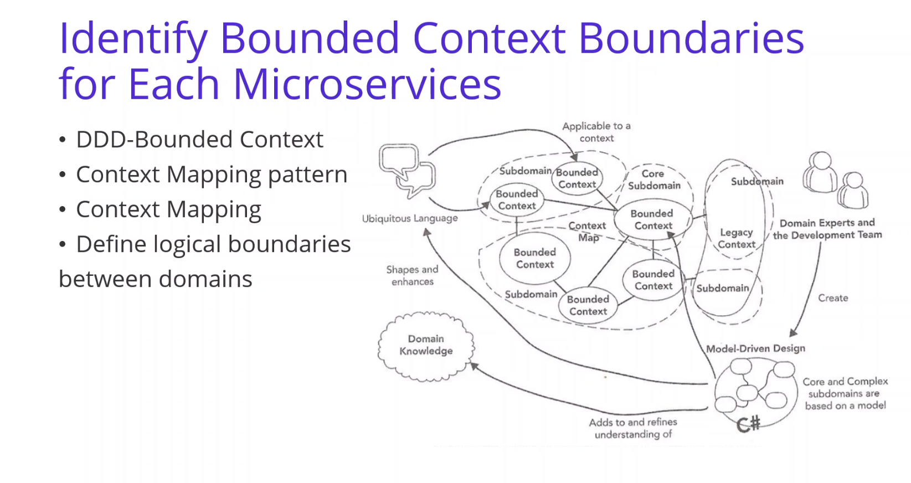
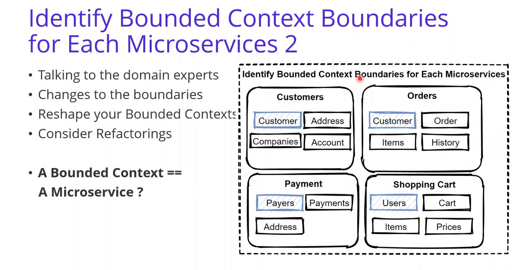

## Domain analysis :

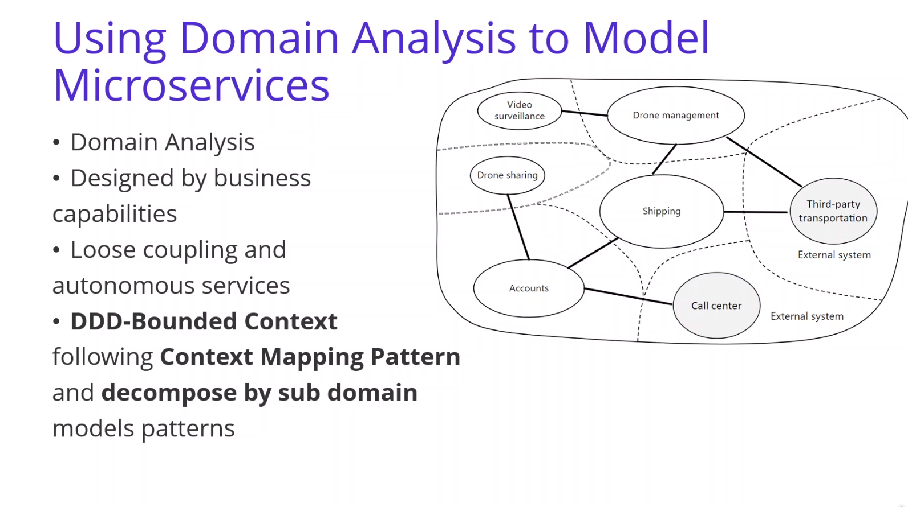

## E-commerce analysis :

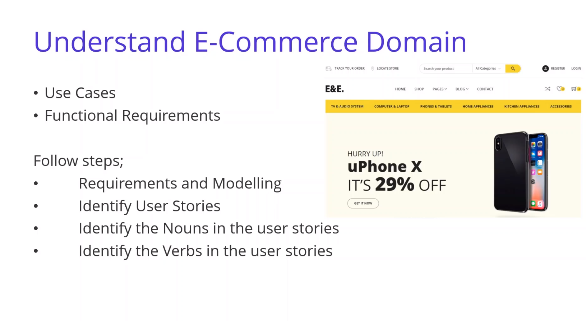
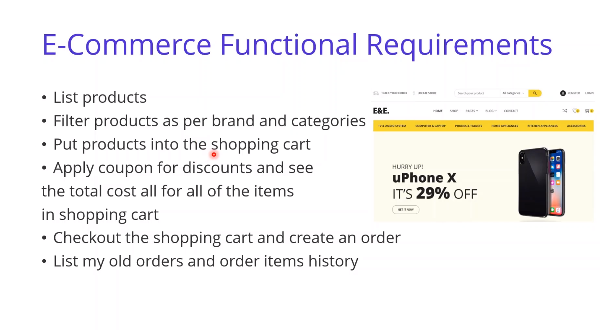
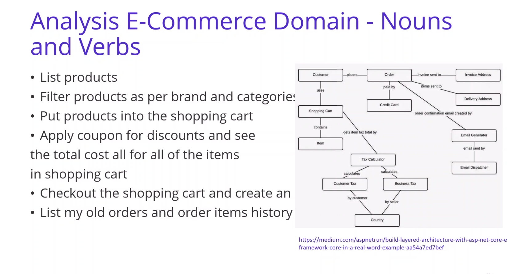
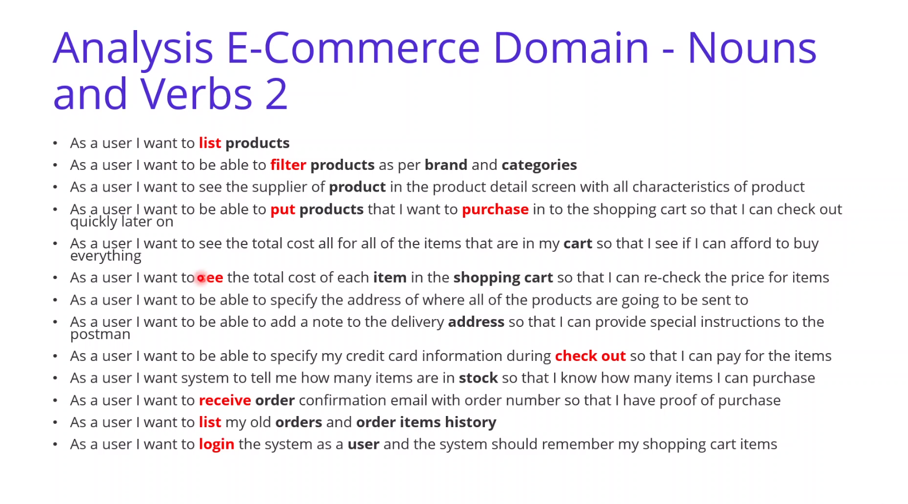
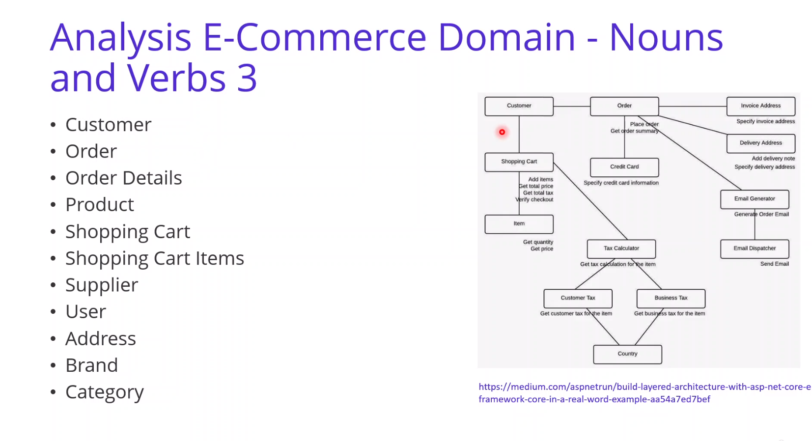
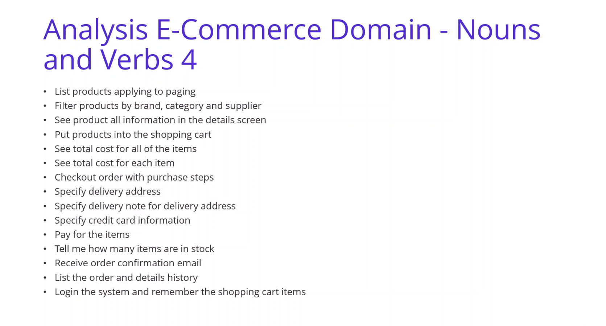

## Identifying E-commerce microservices  :

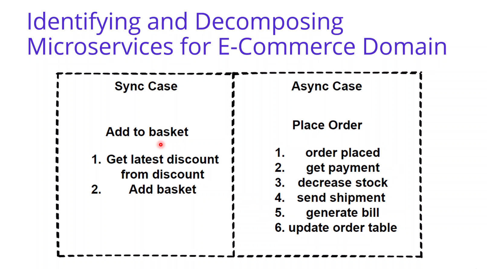

