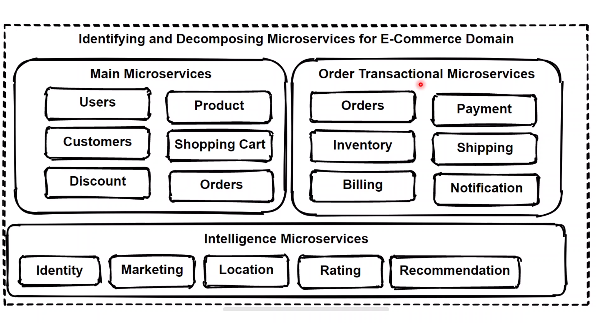

# Microservices decomposition

## Decomposition path :

## Decomposition patterns :

## Bounded context pattern :

## Domain analysis :

## E-commerce analysis :

## Identifying E-commerce microservices  :

