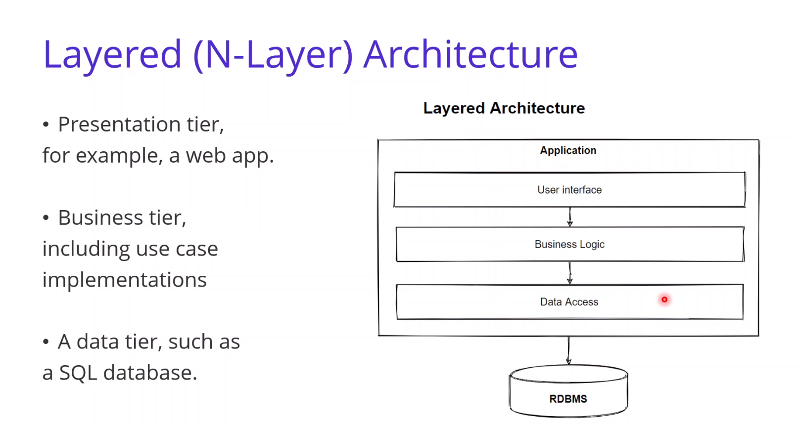
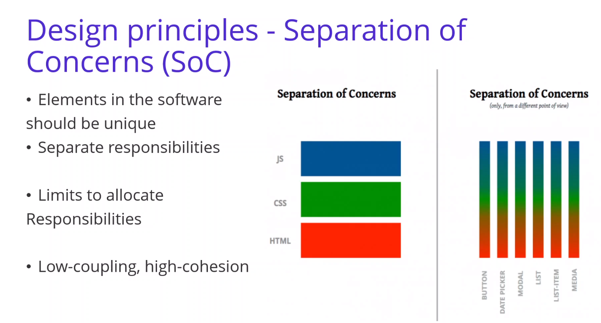
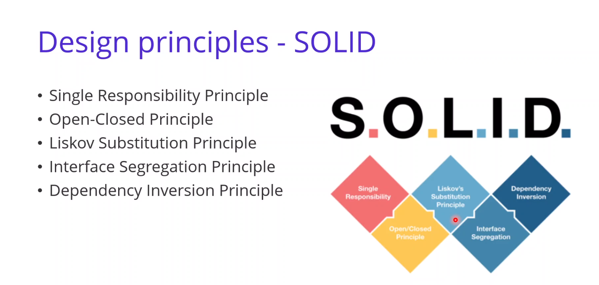
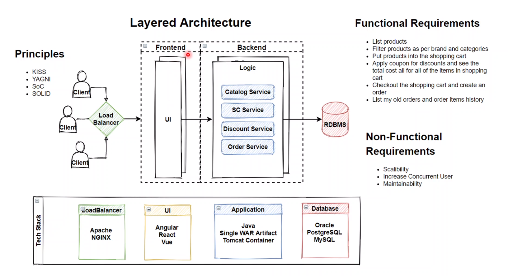

# Layered architecture 

### Simple arch :
Layers can be logical or physical(different software for different layers)

### Design principle : separation of concerns (SOC)

### Design principle : SOLID

### Layers : frontend-backend ~ (ui - business logic)

