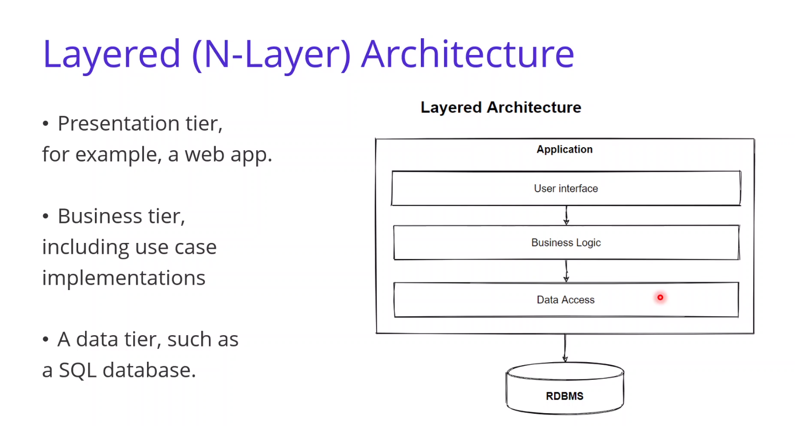

# Layered architecture

## Intro :

Layers can be logical or physical(different software for different layers)

## Design Principle : separation of concerns (SOC) :

## SOLID Design Principle :

## Layers : frontend-backend ~ (ui - business logic)

