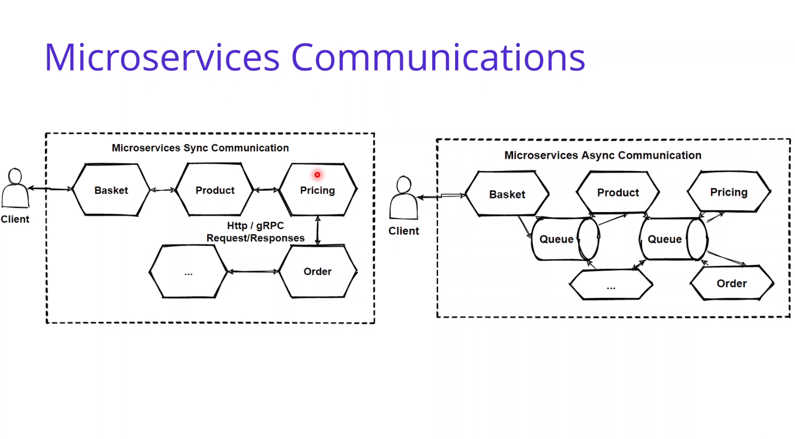
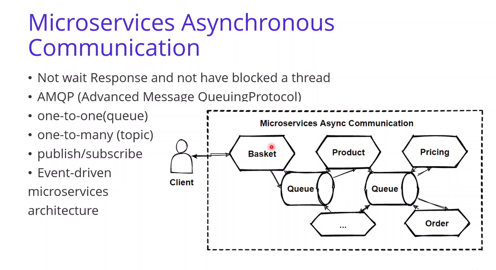
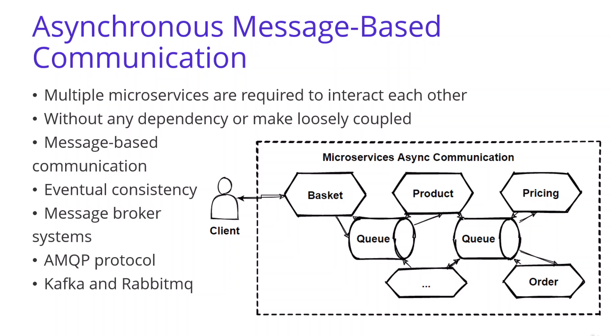
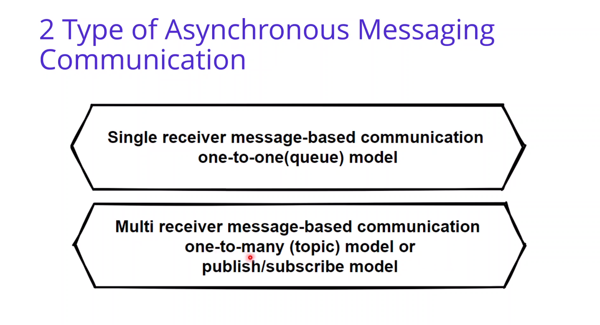
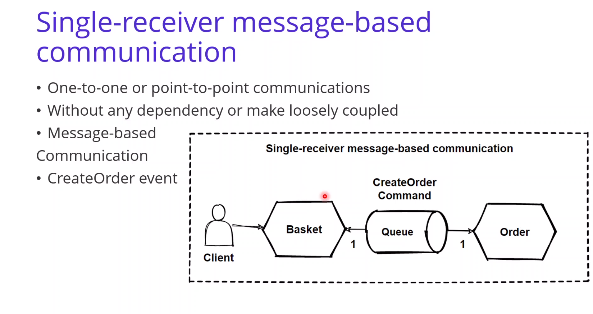
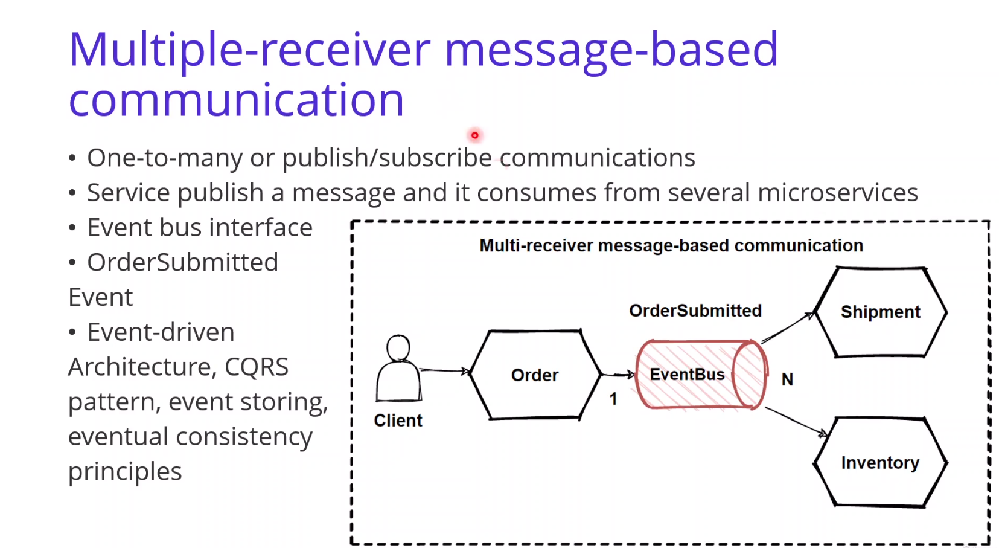
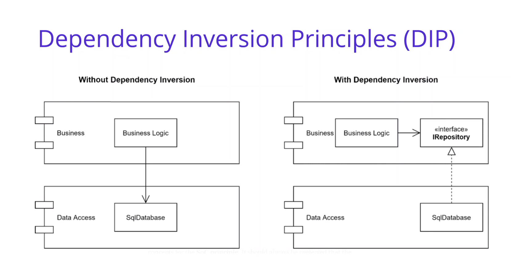
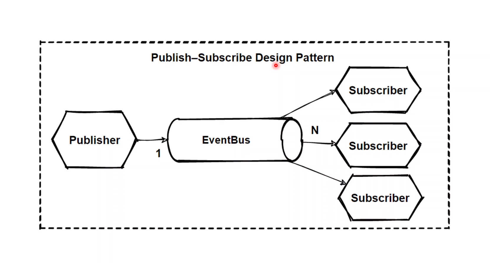
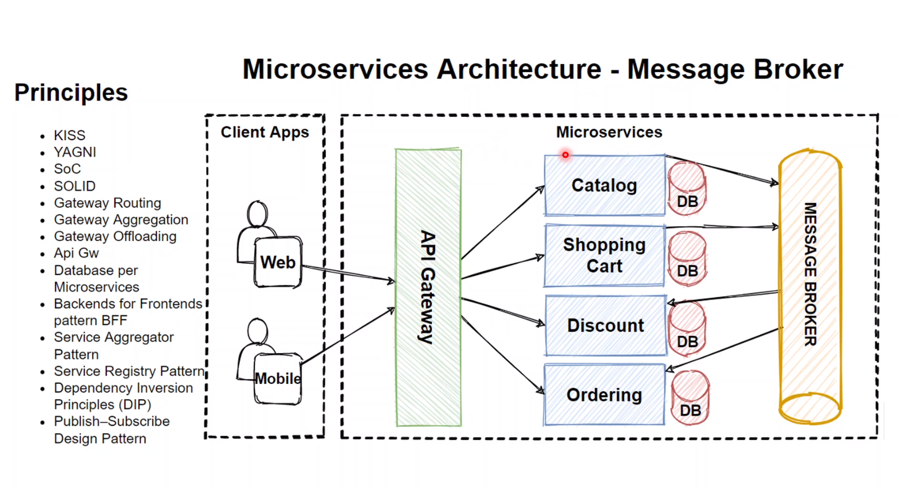

# Microservices Async Communication (message based)

## Microservice 2 types of communications :

## Async Communication :

## Async Message Communication :

## Dependency Inversion Principles :

- [Java dependency inversion](https://www.baeldung.com/java-dependency-inversion-principle)

## Publish-Subscribe Pattern :

