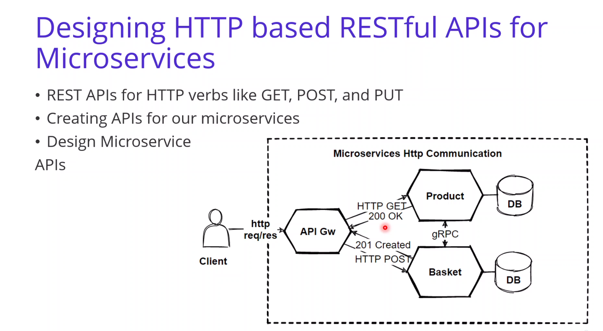

# Microservices communication

## Intro :

## Communication type (sync-async) :

## Communication type (Request Driven - Event Driven) :

## HTTP based RESTful APIS :

- public apis ~ [RESTful API](https://www.ibm.com/cloud/learn/rest-apis)
- Backend apis ~ [gRPC](https://grpc.io/)
   

- [Richardson Maturity Model](https://devopedia.org/richardson-maturity-model)
   

## gRPC :

