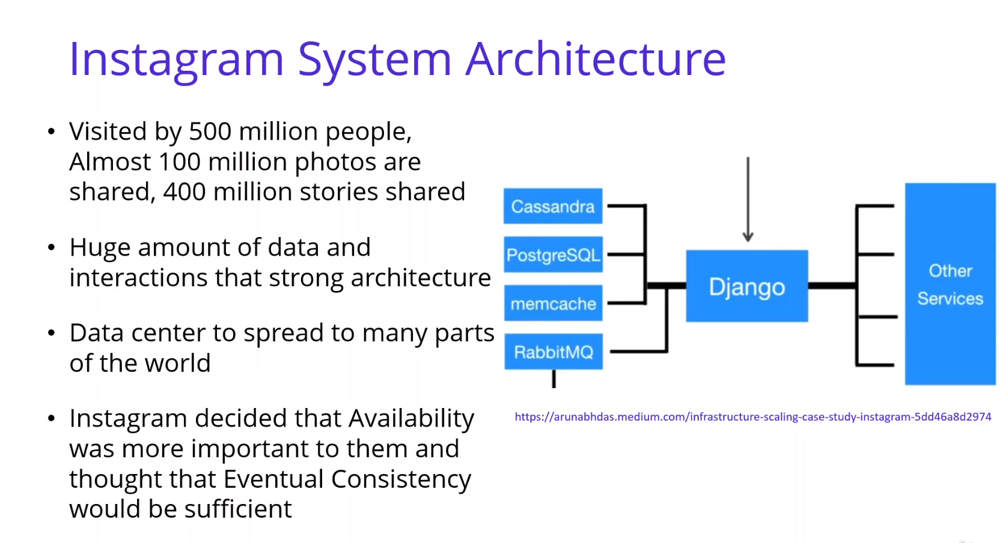
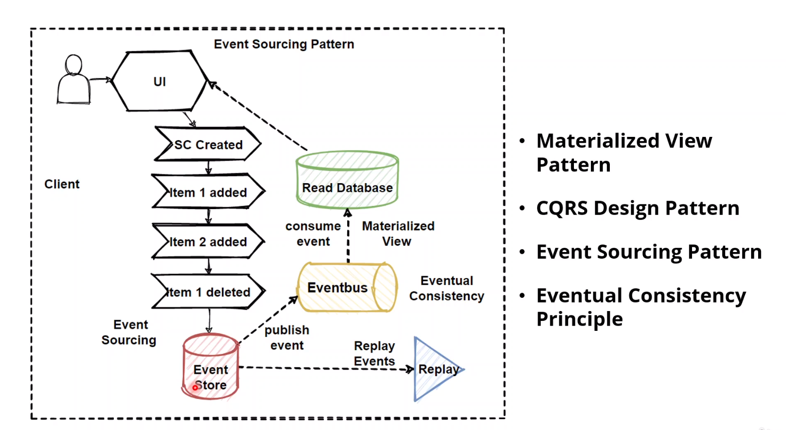

# Microservices Data Management Queries

## Cross-Service Queries :

## Cross Query Solutions :

## CQRS (Command Query Request Segregation) Pattern :

## Instagram Database Architecture :

[Scaling Instagram Infrastructure](https://www.youtube.com/watch?v=hnpzNAPiC0E)

## Event Sourcing Pattern :

## Eventual Consistency Principle :

