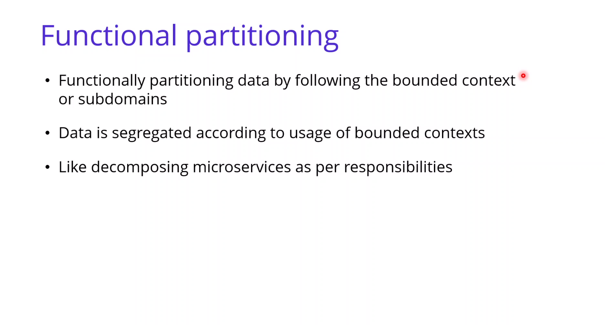
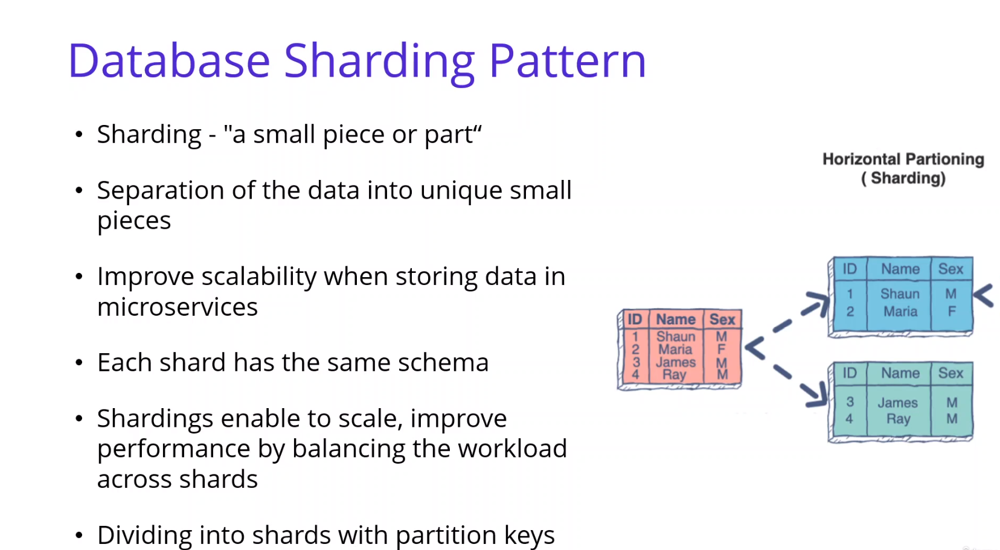

# Microservices Data Management

## Polyglot Persistence :

## Pattern & Principles :

## Database-per-Service Pattern :

## Shared Database Anti-Pattern :

## Relational & NOSQL Databases :

## How to choose a Database for Microservices :

## CAP Theorem (Consistency , Availability and Partition Tolerance )

- [CAP theorem ](https://www.ibm.com/cloud/learn/cap-theorem)
- [CAP theorem proof](https://mwhittaker.github.io/blog/an_illustrated_proof_of_the_cap_theorem/)

## Partition :

- [Sharding ](https://hazelcast.com/glossary/sharding/)

## Database Sharding Pattern :

## Cassandra NOSQL Database :

