# Microservices Gateway

## Direct Client-to-Microservice Communication :

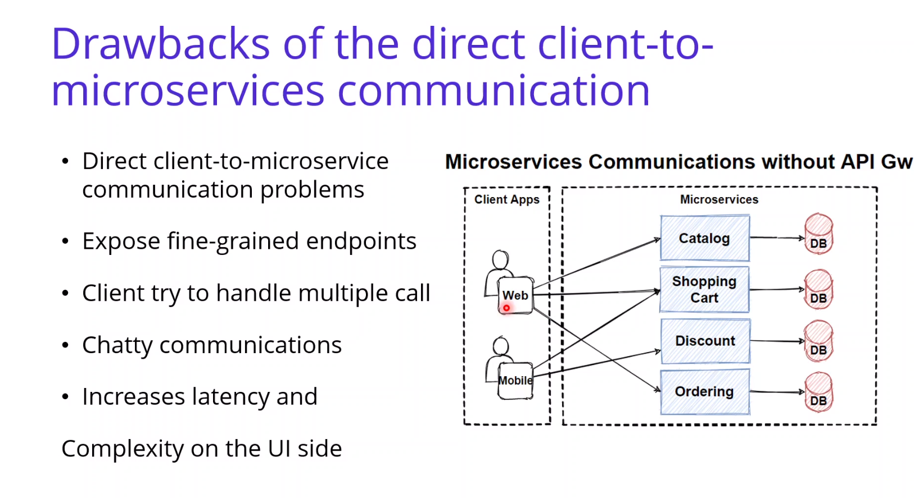

## Gateway :

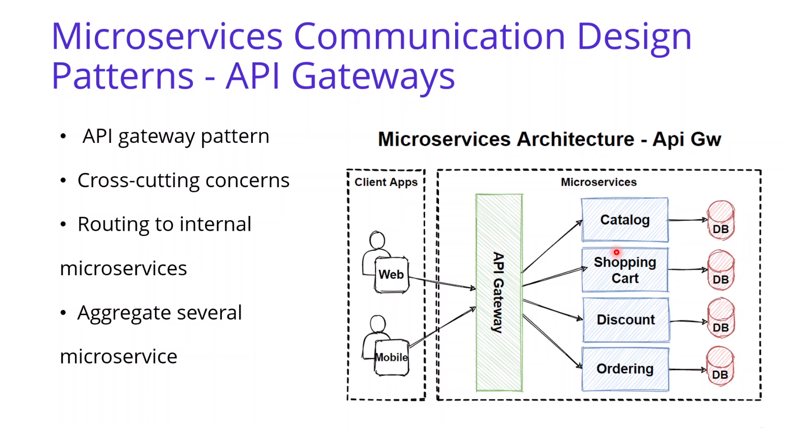
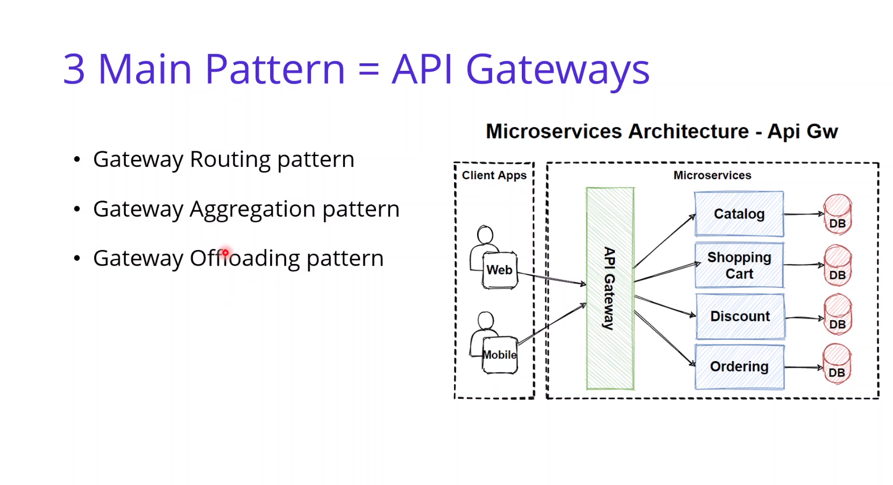

## Gateway Routing Pattern :

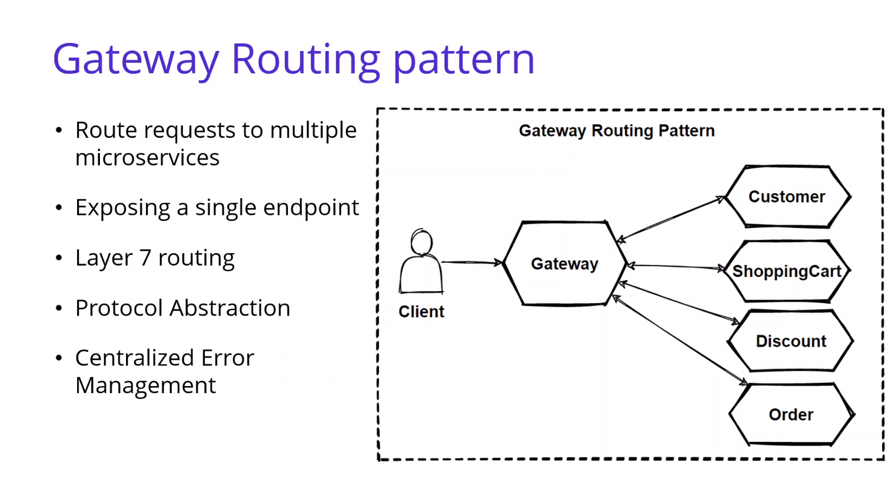

## Gateway Aggregation Pattern :

## API Gateway Pattern :

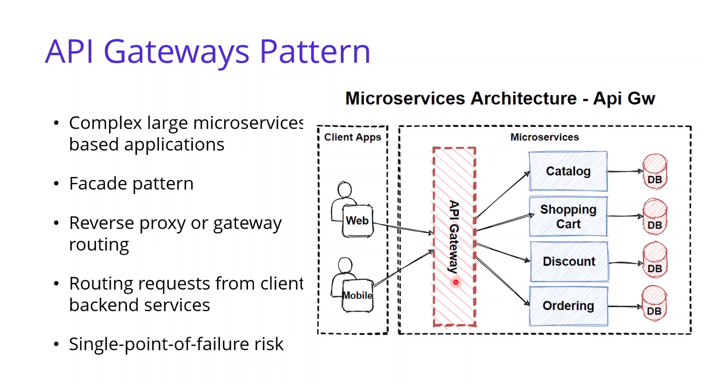
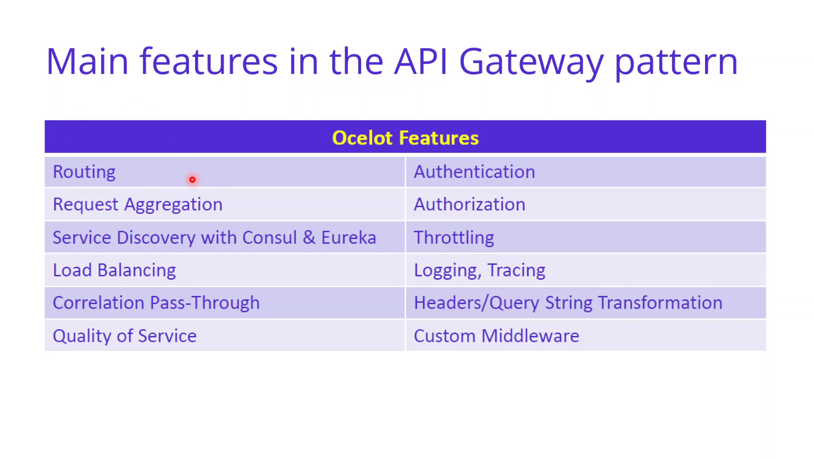

## Backends for Frontends Pattern :

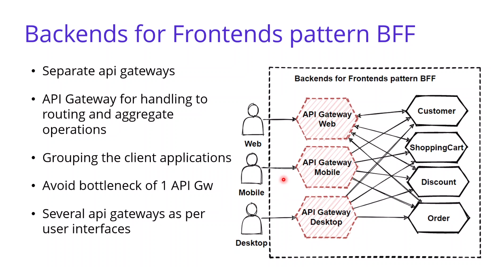
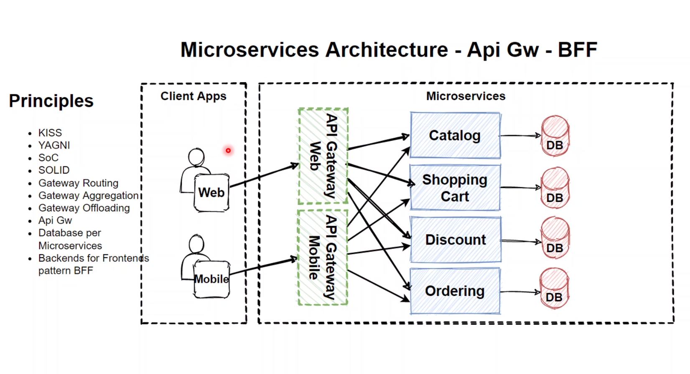

## Service-to-Service Communication :

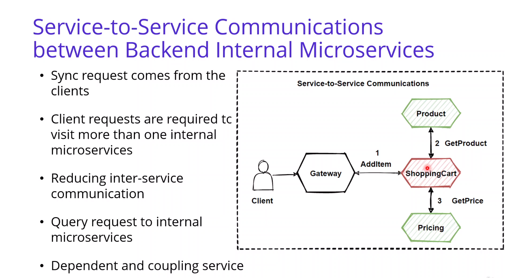
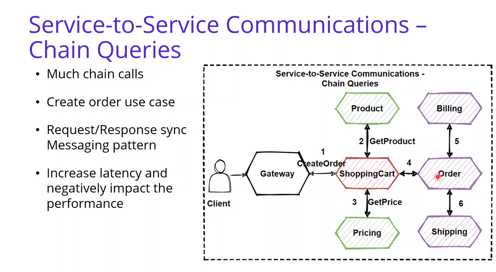

## Service Aggregator Pattern :

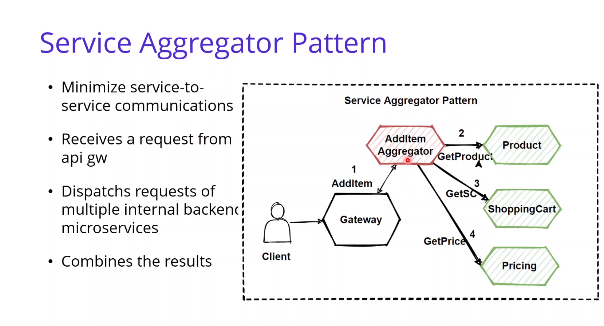

## Service Registry Pattern :

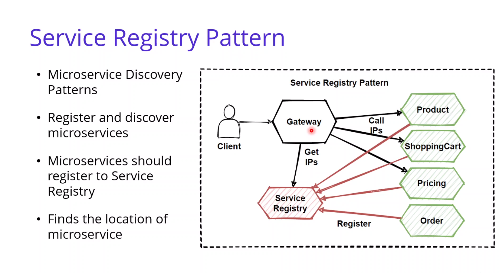