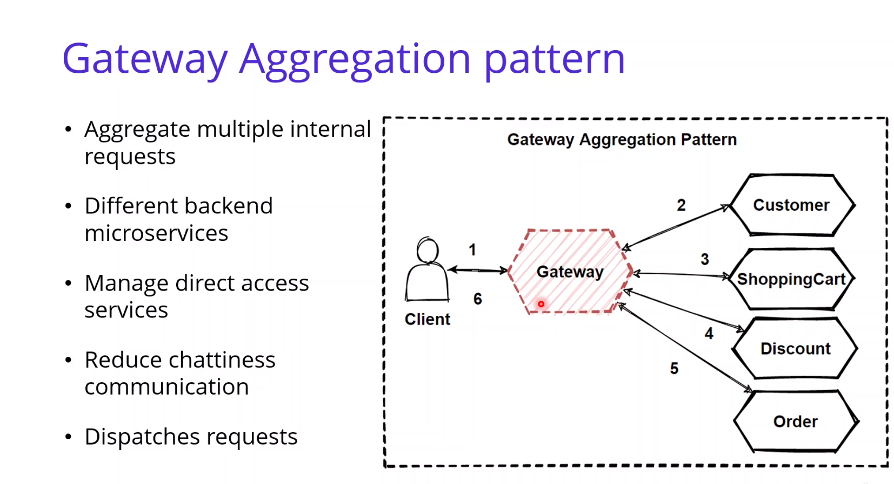

# Microservices Gateway

## Direct Client-to-Microservice Communication :

## Gateway :

## Gateway Routing Pattern :

## Gateway Aggregation Pattern :

## API Gateway Pattern :

## Backends for Frontends Pattern :

## Service-to-Service Communication :

## Service Aggregator Pattern :

## Service Registry Pattern :

