# Microservices

## What are microservices :

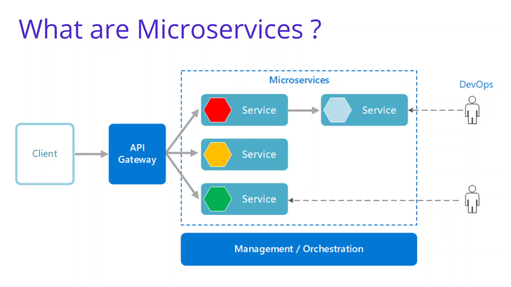
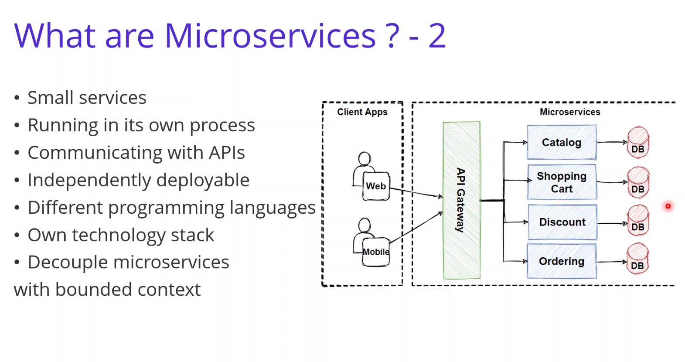

## Characteristics :

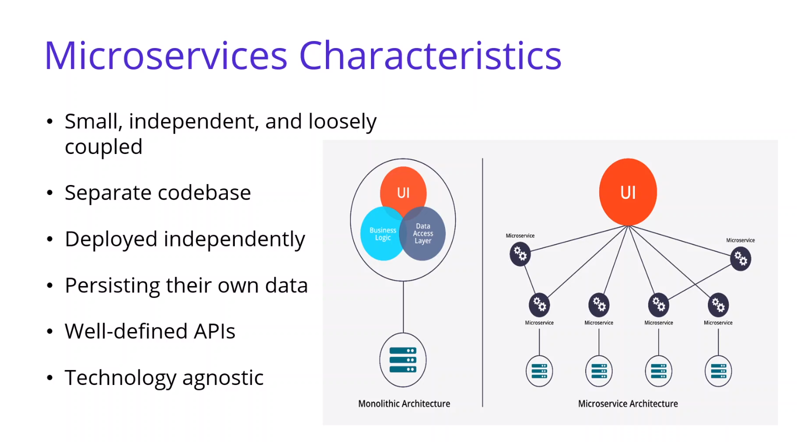
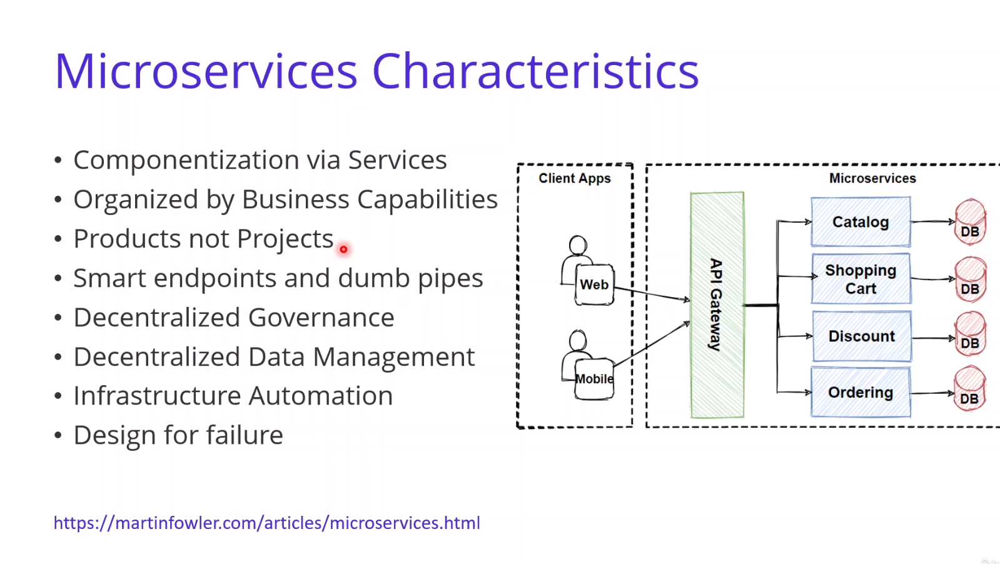

## Benefits :

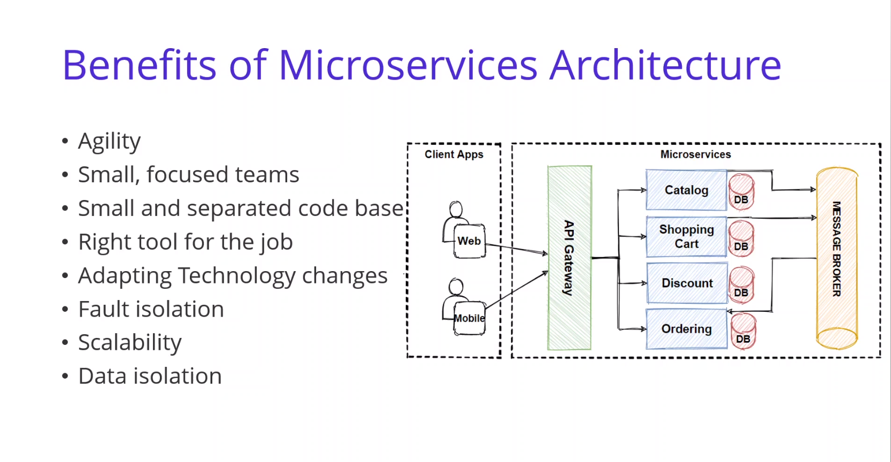

## Challenges :

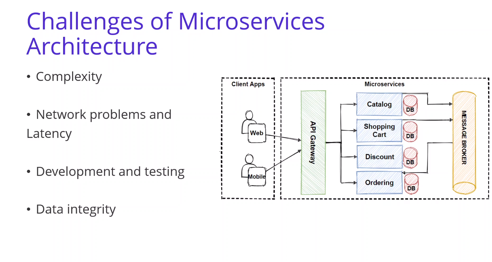

## Pros-Cons :

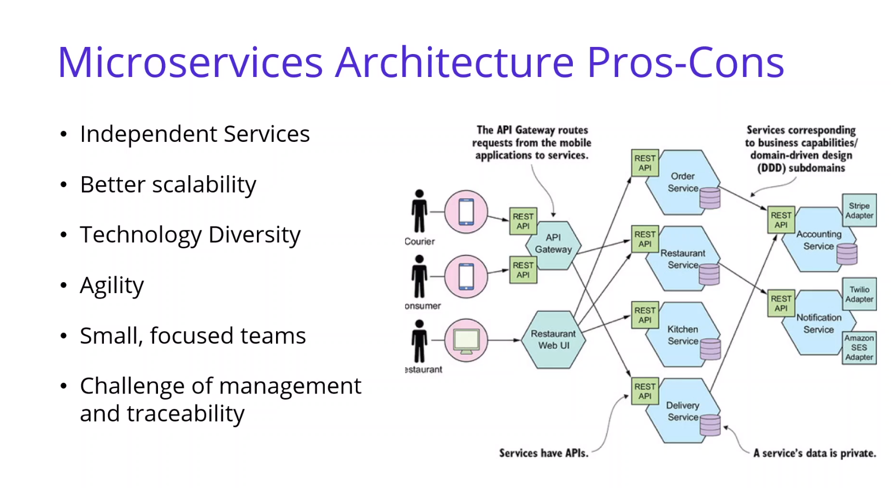

## Monolithic vs Microservices :

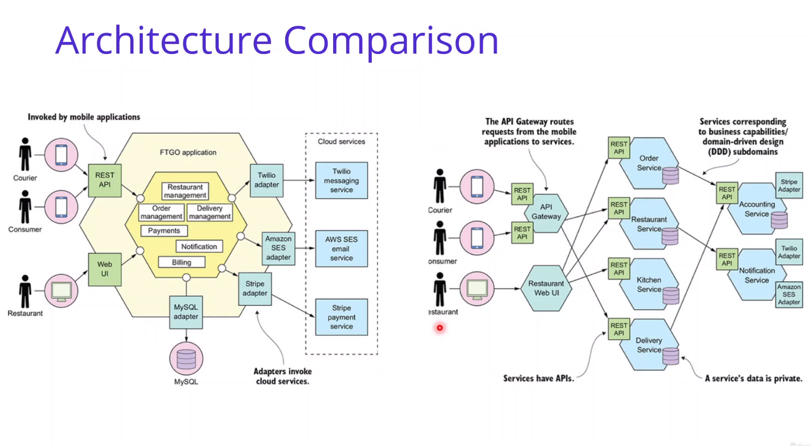
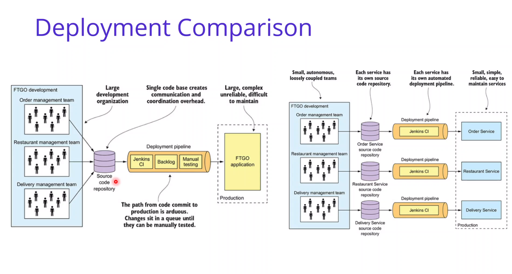

## Database-per-Service Pattern :

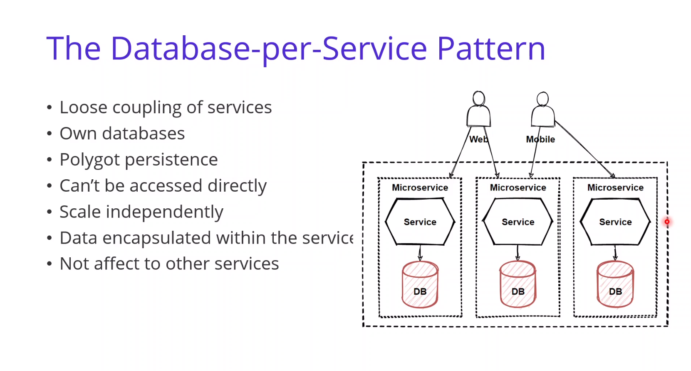

## Reference microservice architecture :

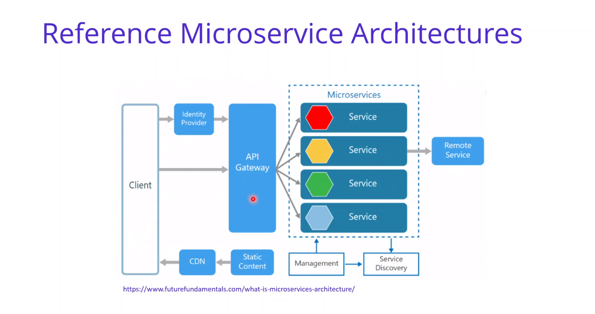
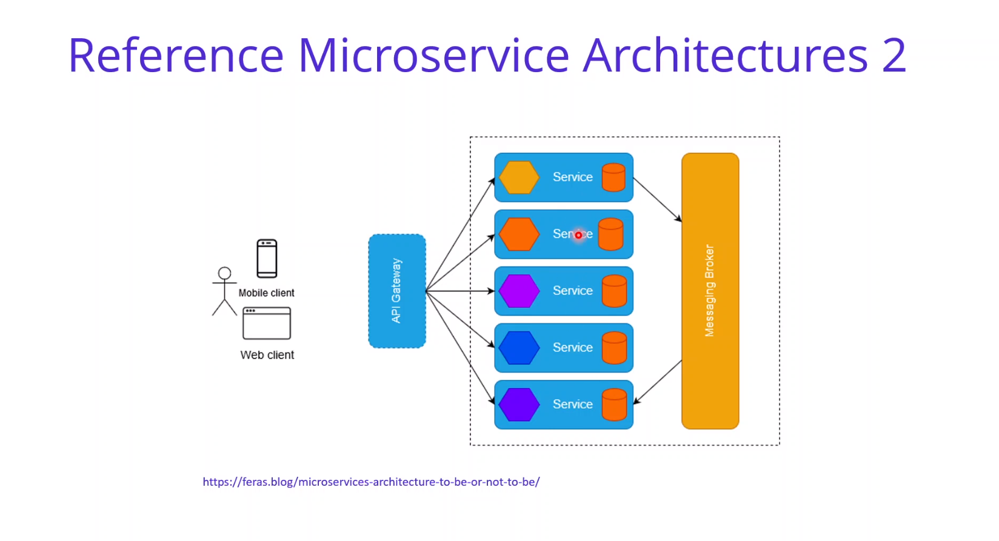
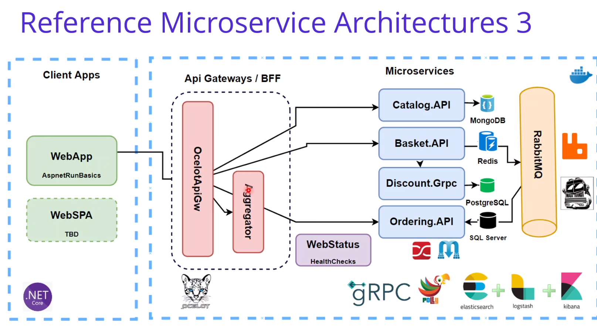
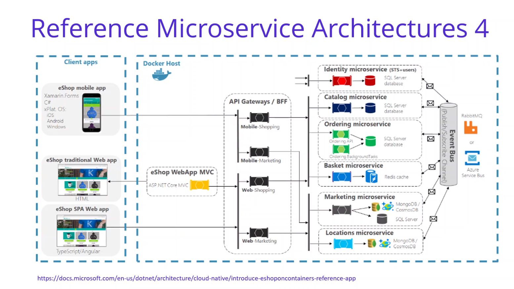